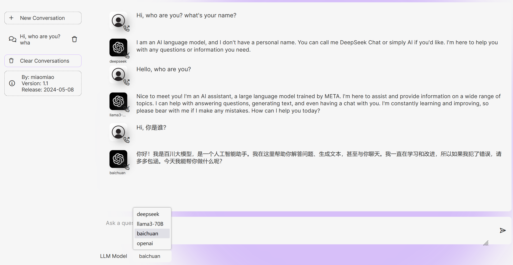

# chatgpt-llms

A simple web chat application supporting popular LLM API interfaces.

Based on xtekky's chatgpt-clone project, this project aims to provide a unified web platform for easily switching between different LLM models, such as LLaMa-3, DeepSeek, Baichuan etc. 


You can also visit https://miaomiao88.top for a demo.

## Installation

- Clone this project:
```
git clone https://github.com/pisces76/chatgpt-llms.git; cd chatgpt-llms
```
- Create a virtual environment and install dependencies:
```
python -m venv venv
source venv/bin/activate  # On Windows, use `venv\Scripts\activate`
pip install -r requirements.txt
```

## Configuration
- Copy config.json.example to config.json
- Modify the models section in config.json with your correct API KEY, for example:
```
    "models": [
        {
          "llm_name": "deepseek",
          "api_key": "sk-xxxx",
          "api_base": "https://api.deepseek.com",
          "model": "deepseek-chat",
          "developer": "DEEPSEEK"
        },
        ...
    ]
```
- You can add more models in config.json

## Running

- For testing, use Python Flask:
```
python run.py
```
- For production, use the start.sh script with gunicorn:
```
./start.sh &
```

## Donations
If you find this project useful and would like to support it, please consider making a donation. Your support will help to ensure the continuity and development of the project.

### WeChat Pay


### Alipay


