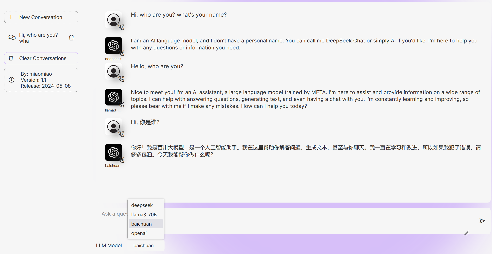

# chatgpt-llms
一个简单的web chat GPT应用，支持常用的LLM API接口。

基于xtekky大神的chatgpt-clone项目的二次开发。原项目因为使用openAI的API接口，对免费党不够友好。好在，现在有不少免费或便宜的API接口（比如LlaMa-3，DeepSeek等）。此外，很多人拥有多个大模型的API接口。也需要一个方便统一调用的web平台。所以，就有了这个项目。运行示例如下图，可以从"LLM Model"下拉框中选取不同模型，即可与之对话。



## 安装
- clone 本项目
```bash
git clone https://github.com/pisces76/chatgpt-llms.git; cd chatgpt-llms
```
- 创建虚拟环境及依赖包 
```
python -m venv venv
source venv/bin/activate  # On Windows, use `venv\Scripts\activate`
pip install -r requirements.txt
```

## 配置
- copy config.json.example config.json
- 修改config.json中的models部分，填入正确的API KEY，例如：
```
    "models": [
        {
          "llm_name": "deepseek",
          "api_key": "sk-xxxx",
          "api_base": "https://api.deepseek.com",
          "model": "deepseek-chat",
          "developer": "DEEPSEEK"
        },
        ... 
    ]
```

## 运行
- 测试环境，使用python flask
```
python run.py
```

- 真实环境，使用脚本调用gunicorn
```
./start.sh &
```


